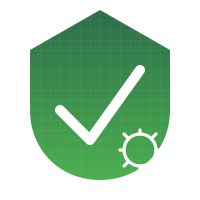

<p align="center">
    
</p>


#  PrepperApp - Deine Survival-Checkliste

🚧 **Dieses Projekt befindet sich noch im WIP (Work in Progress) Status.** 🚧

Die **PrepperApp** ist eine umfassende Anwendung zur Vorbereitung auf Notfälle und Krisensituationen. Sie ermöglicht es, individuelle Checklisten für verschiedene Szenarien zu erstellen, Vorräte zu verwalten und wichtige Informationen jederzeit griffbereit zu haben. Die App richtet sich an Outdoor-Enthusiasten, Prepper, Survival-Experten und alle, die auf unvorhersehbare Ereignisse vorbereitet sein möchten.

## 🚀 Features
- **Dynamische Checklisten**: Erstelle individuelle Listen für verschiedene Notfallszenarien
- **Vorratsverwaltung**: Behalte den Überblick über Lebensmittel, Medikamente und Ausrüstung
- **Benachrichtigungen & Erinnerungen**: Erhalte rechtzeitig Hinweise zu ablaufenden Vorräten
- **Offline-Modus**: Nutzung der App ohne Internetverbindung
- **Datenexport & -import**: Sichere und teile deine Checklisten problemlos

## 📱 Technologien
- **React** (Frontend, ursprünglich als Prüfungsarbeit einer React-Schulung entwickelt)
- **Python** (Backend mit Flask/FastAPI, später integriert)
- **SQLite / PostgreSQL** (Datenbank)
- **Docker** (Containerisierte Bereitstellung)
- **REST API** für externe Integrationen

## 🛠️ Installation & Nutzung
### 1️⃣ Voraussetzungen
- Python 3.10+
- Node.js (falls ein Web-Frontend vorhanden ist)
- Docker (optional für einfache Bereitstellung)

### 2️⃣ Installation
```sh
git clone <repository-url>
cd prepper-app
python -m venv venv
source venv/bin/activate  # Windows: venv\Scripts\activate
pip install -r requirements.txt
```

### 3️⃣ Start der Anwendung
```sh
python run.py
```
Die Anwendung läuft unter `http://127.0.0.1:5000/`

## 🌍 Deployment
- **Docker**: Erstelle ein Container-Image und deploye es einfach auf einem Server
- **Render / Heroku**: Unterstützt einfaches Hosting und automatische Skalierung
- **AWS / DigitalOcean**: Bereitstellung in der Cloud mit hoher Verfügbarkeit

## ⚠️ Sicherheitshinweise
- Speichere sensible Daten wie API-Keys als Umgebungsvariablen
- Halte deine Abhängigkeiten aktuell (`pip list --outdated`)
- Nutze HTTPS für eine sichere Verbindung

## 🛠️ Fehlerbehebung
| Problem | Lösung |
|---------|---------|
| **ModuleNotFoundError** | Stelle sicher, dass alle Abhängigkeiten installiert sind: `pip install -r requirements.txt` |
| **Port bereits belegt** | Starte die Anwendung auf einem anderen Port: `flask run --port=5001` |
| **Fehlende Datenbank** | Stelle sicher, dass die SQLite/PostgreSQL-Datenbank korrekt initialisiert wurde |

## 🤝 Mitwirken
Du möchtest zur Weiterentwicklung der PrepperApp beitragen? 
1. Forke das Repository
2. Erstelle einen Branch für deine Änderungen
3. Sende einen Pull-Request

## 📄 Lizenz
Dieses Projekt steht unter der **MIT-Lizenz** und kann frei genutzt, verändert und verbreitet werden.

---

🔦 **Sei vorbereitet – mit der PrepperApp!**

